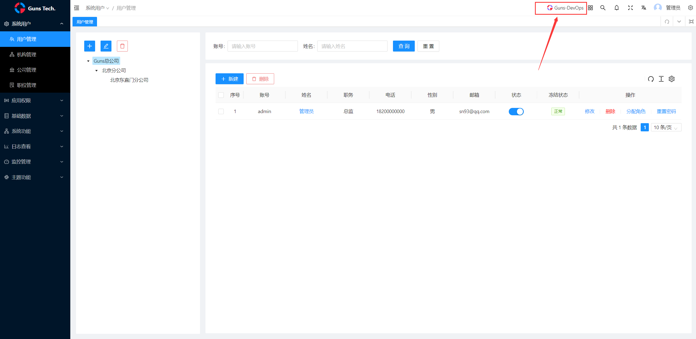
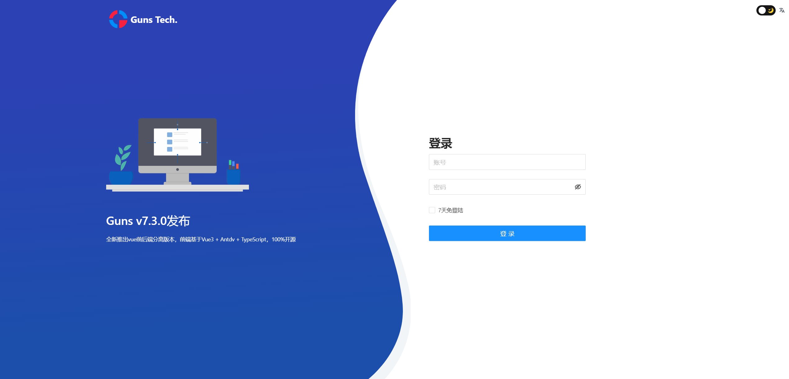
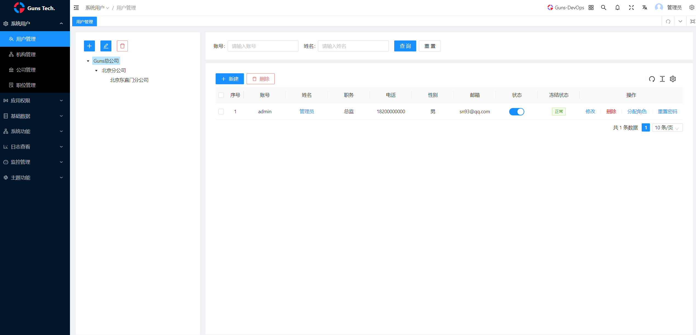
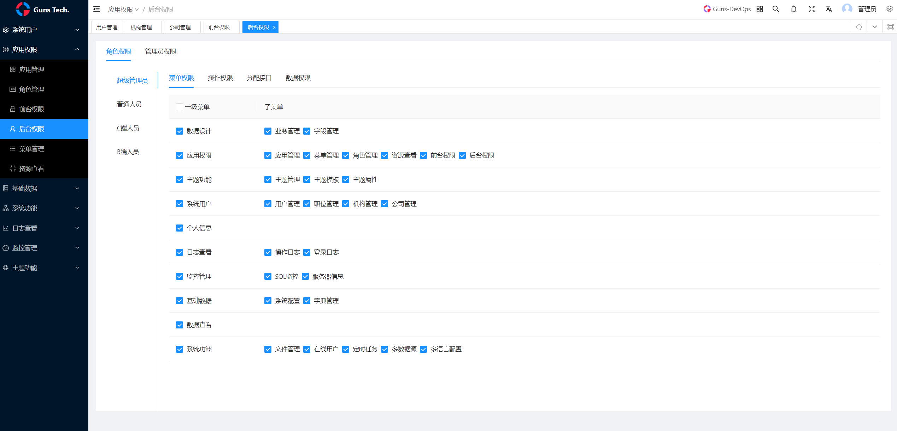
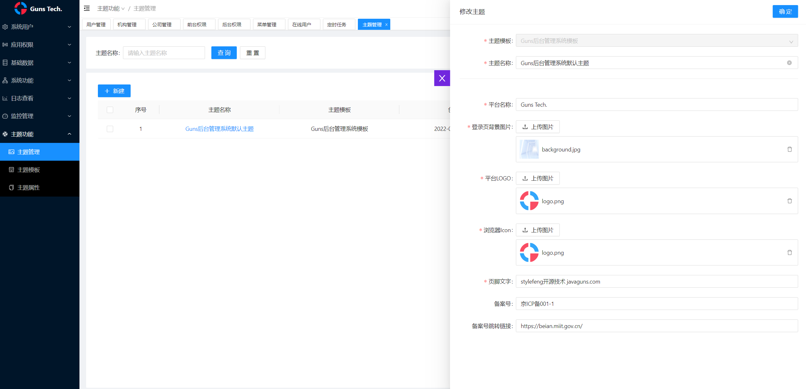

<p align="center">
    
    <br>      
    <br>      
    <p align="center">
        Guns是一个现代化的Java应用开发框架，基于主流技术Spring Boot2 + Vue3，Guns的核心理念是提高开发人员开发效率，降低企业信息化系统的开发成本。
        <br>
        <br>
        <a href="http://spring.io/projects/spring-boot">
            
        </a>
        <a href="http://mp.baomidou.com">
            
        </a>  
        <a href="https://www.hutool.cn/">
            
        </a>
        <a href="http://ibeetl.com/">
            
        </a>  
    </p>
</p>

-----------------------------------------------------------------------------------------------

## 官方网站

[https://www.javaguns.com/](https://www.javaguns.com/)

## 快速启动

Guns v7.3.1前端启动详情见：[https://gitee.com/stylefeng/guns-vue3-admin](https://gitee.com/stylefeng/guns-vue3-admin)

以下为后台启动的过程：

1. 在mysql数据库中创建guns数据库，推荐mysql 5.7或8版本。

2. 修改`application-local.yml`中的数据库连接配置连接到您的数据库。

3. 打开`GunsApplication`运行main方法即可启动，注：新版无需运行sql初始化文件，因为集成了flyway会自动初始化表。

4. 初始化账号密码：admin/123456

## 扫码关注官方公众号和官方微信群
<table>
    <tr>
        <td>官方公众号</td>
        <td></td>
        <td>扫码邀请入群</td>
        <td></td>
    </tr>
</table>

## 更新日志

### v7.3.1-2022年11月7日

更新7.3.1版本的核心包，Roses核心包已经推送至中央仓库，无需手动本地install roses模块即可启动。

### v7.3.0-2022年10月31日

最新v7.3.0版本，有两个大的新特性：

1. 移除前后端不分离Layui的前端界面，提供Vue版本的前端集成。从v7.3.0起，将不再支持Layui版本的更新（如需旧版本可以在Gitee Tag中找到历史版本）。

2. 提供对Guns-DevOps的快速集成方式。之前DevOps平台仅支持CentOS的一键部署，现在使用v7.3.0可以通过pom集成的方式，直接启动Guns项目就可以启动Guns-DevOps平台，但仍需配置秘钥。

#### devops集成指南

devops功能以Jar包集成的方式集成到项目，Guns-DevOps功能不开放源码。

1. [点此下载Guns私服库的maven settings.xml](https://gitee.com/stylefeng/guns/blob/master/_devops/settings.xml) 替换掉你的本地的maven配置文件。

2. 在Guns项目的pom.xml中引入如下模块

```xml
<!--Guns-DevOps集成-->
<dependency>
    <groupId>cn.stylefeng.roses</groupId>
    <artifactId>kernel-s-devops-integration</artifactId>
    <version>${roses.kernel.version}</version>
</dependency>
```

3. **关键步骤**，在[https://javaguns.com/](https://javaguns.com/) 官网注册一个号，在官网右上角个人信息，申请一个平台秘钥，并在`application.yml`中配置`user.key`

```shell
# yml配置文件中加入如下配置
user:
  key: xxxxxxxx
```

4. 启动项目后，界面上点击右上角，即可跳转到Guns-DevOps平台



5. 项目上线后，再把Guns-DevOps相关依赖删掉，以减轻Jar包的重量

## Guns介绍

Guns是一个现代化的Java应用开发框架，基于主流技术**Spring Boot2 + Vue3 + Antd Vue**，Guns基于**插件化架构**，通过灵活组装插件，可以进行集成和拓展相关功能。

**Guns v7.3.1**已经发布，前后端代码以及核心包源码，均可在如下Gitee仓库可找到：

前端代码：[https://gitee.com/stylefeng/guns-vue3-admin](https://gitee.com/stylefeng/guns-vue3-admin)

后端代码：[https://gitee.com/stylefeng/guns](https://gitee.com/stylefeng/guns)

核心包：[https://gitee.com/stylefeng/roses](https://gitee.com/stylefeng/roses)

经过多年发展，Guns已在业界具有一定影响力。Guns技术架构可以直接应用到任何软件产品和技术公司自身的技术体系建设中，帮助企业解决**规范问题**，解决**复用问题**，解决**架构问题**。









## Guns功能列表

- 1.控制面板
- 2.用户管理
- 3.职位管理
- 4.机构管理
- 5.应用管理
- 6.角色管理
- 7.菜单管理
- 8.资源查看
- 9.系统配置
- 10.字典管理
- 11.在线用户
- 12.定时任务
- 13.文件管理
- 14.多数据源
- 15.操作日志
- 16.登录日志
- 17.通知管理
- 18.SQL监控
- 19.服务器信息
- 20.持续更新...

## Guns插件列表

Guns默认封装了很多功能插件，引用这些插件并使用相关接口，开箱即用，也可以以插件化方式拓展自定义的插件：

- 1.缓存插件（内存和Redis）
- 2.系统配置
- 3.多数据源插件
- 4.邮件插件
- 5.文件插件（minio、本地、阿里云、腾讯云）
- 6.groovy脚本
- 7.jwt插件
- 8.日志插件（文件、数据库）
- 9.excel导出
- 10.拼音转化
- 11.短信插件（阿里云、腾讯云）
- 12.websocket
- 13.定时任务
- 14.参数校验
- 15.wrapper包装
- 16.C端用户
- 17.Demo拦截器
- 18.消息插件
- 19.持续更新...

## Guns曾获荣誉

*Gitee GVP最有价值开源项目。*

*开源中国2018年度最受欢迎中国开源软件。*

*开源中国2019年度最受欢迎中国开源软件。*

*开源中国2020年度最受欢迎中国开源软件。*

*开源中国2021年度最受欢迎中国开源软件。*

*2021“科创中国”开源创新榜－－年度优秀开源产品。*


